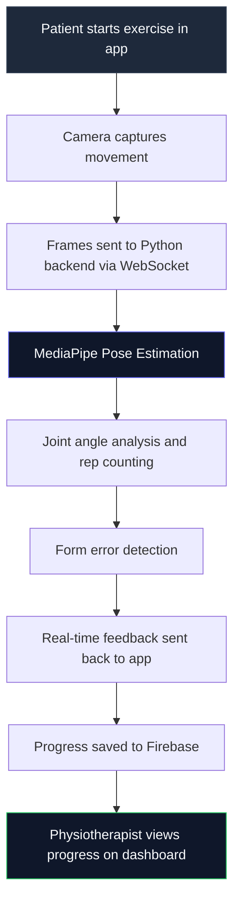

# PhysioGo


AI-powered physiotherapy app that lets patients do rehab exercises at home while getting real-time feedback on their form. Built as my Final Year Project at FAST-NUCES.

The core idea: a physiotherapist assigns exercises, the patient opens the app, the camera tracks their pose using MediaPipe, and the system counts reps, detects form errors, and reports progress back to the therapist. No clinic visit needed for routine sessions.

---

## ⚡ How it works



---

## 🛠️ Stack

| Layer | Technology |
|---|---|
| Mobile App | Flutter (Android and Web) |
| Pose Estimation | MediaPipe |
| Backend | Python, FastAPI |
| Real-time Communication | WebSocket, WebRTC |
| Database and Auth | Firebase (Firestore, Authentication) |
| Deployment | Docker, Koyeb |

---

## 📸 Screenshots

<p align="center">
  
  &nbsp;&nbsp;
  
  &nbsp;&nbsp;
  
</p>

<p align="center">
  
  &nbsp;&nbsp;
  
  &nbsp;&nbsp;
  
</p>

---

## 📁 Project structure

```
physiogo/
├── frontend/            # Flutter app
│   ├── lib/
│   │   ├── screens/     # patient and therapist views
│   │   ├── services/    # API and Firebase calls
│   │   └── models/      # data models
├── backend/             # Python pose estimation server
│   ├── pose/            # MediaPipe processing
│   ├── websocket/       # real-time frame handling
│   └── api/             # REST endpoints
├── assets/              # UI assets and icons
└── pubspec.yaml         # Flutter dependencies
```

---

## 🚀 Running locally

**Backend**

```bash
cd backend
pip install -r requirements.txt
uvicorn main:app --reload
```

**Frontend**

```bash
flutter pub get
flutter run
```

Add your `google-services.json` to `android/app/` before running.

---

## 💡 What I learned building this

Real-time pose estimation over WebSocket is harder than it looks. The main challenge was keeping latency low enough that feedback feels instant. Sending every frame was too slow so I implemented frame skipping and only processed every Nth frame based on the exercise type.

Rep counting is a geometry problem. Most exercises reduce to tracking a specific joint angle crossing a threshold. Getting that threshold right for different body types and camera angles took a lot of iteration.

WebRTC for the video stream and WebSocket for the feedback channel is the right split. Mixing both on one connection causes issues under load.

---

## 📬 Contact

Built by Abdullah Khalid

[](https://www.linkedin.com/in/-abdullah-khalid)
[](mailto:abdullahkh.cs@gmail.com)
[](https://ak-abdullah.github.io/Resume/)
